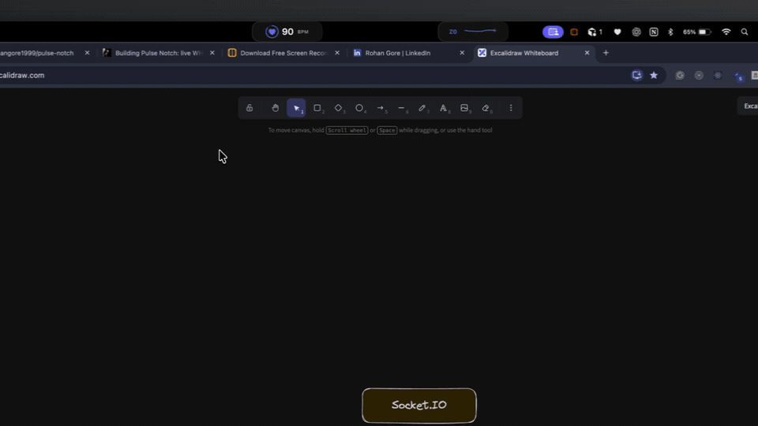

# Pulse Notch

Pulse Notch is a local macOS heart-rate threshold companion for WHOOP 5.0. It reads the standard Bluetooth Heart Rate Service directly from WHOOP Heart Rate Broadcast and presents live BPM in the drawable areas around the MacBook camera cutout.

<p align="center">
  
</p>

## Download and install manually

<a href="https://github.com/rohangore1999/pulse-notch/releases/latest/download/PulseNotch.dmg"></a>

**Apple Silicon only:** macOS 13 or newer on an M1 Mac or newer.

Once downloaded, open `PulseNotch.dmg` and drag **Pulse Notch** into the **Applications** shortcut in the installer window.

> [!IMPORTANT]
> Pulse Notch is currently ad-hoc signed for packaging. It is not signed with an Apple Developer ID and is not notarized by Apple, so macOS will block its first launch and warn that Apple could not verify the app. This is expected for the current release.
>
> You need to approve the app manually before it will open. You normally need to do this only once for each downloaded release. Follow the steps below.

### Allow the first launch

1. Eject the disk image, then try to open **Pulse Notch** from Applications once.
2. After macOS blocks it, open **System Settings → Privacy & Security**.
3. Scroll to **Security**, click **Open Anyway** for Pulse Notch, and authenticate if asked.
4. Confirm **Open**, then allow Bluetooth access and follow setup to select your WHOOP explicitly.

The **Open Anyway** option appears only after the blocked launch attempt and may be available for a limited time. A work- or school-managed Mac can hide or disable it; contact your administrator rather than bypassing that policy.

## System requirements

- Apple Silicon Mac (M1 or newer); Intel Macs are not supported
- macOS 13 Ventura or newer
- WHOOP 5.0 with Heart Rate Broadcast enabled

## How the BLE connection works

```text
WHOOP sensor → Bluetooth Heart Rate Broadcast → Pulse Notch → live BPM and local threshold cues
```

1. When **Heart Rate Broadcast** is enabled, WHOOP advertises the standard Bluetooth Low Energy Heart Rate Service (`180D`).
2. Pulse Notch uses Apple's CoreBluetooth framework to scan locally for nearby devices advertising that service and shows the matching devices for you to choose from. It does not automatically approve an unknown monitor.
3. After you select your WHOOP, Pulse Notch connects directly from the Mac and subscribes to the standard Heart Rate Measurement characteristic (`2A37`).
4. WHOOP sends heart-rate measurement notifications over that BLE connection. Pulse Notch decodes the BPM and available sensor-contact state, updates the notch and one-hour chart, and evaluates your threshold locally.
5. Only a device that has delivered a valid heart-rate measurement is remembered for reconnection. Pulse Notch listens to the broadcast; it does not start workouts, change WHOOP settings, or write data back to the device.

This live path is device-to-Mac BLE and does not use the WHOOP cloud API.

## What is implemented

- A true cutout-aware compact view: live BPM on the left, zone and 60-second trend on the right
- Adaptive Liquid Glass on macOS 26 with a material fallback and accessibility-safe opaque mode on older systems
- A single-pass, interruption-safe downward morph with fast staged chart/actions, plus a rolling one-hour minute-average trend, reset, snooze, and settings
- Blue normal state, blue pending dwell progress, amber confirmed elevation, and gray stale/disconnected states
- User-configured sustained threshold and snooze, plus hysteresis, restrained cooldown, and factual macOS notifications
- A guided 60-second inhale-4/exhale-6 reset and completion state
- First-run WHOOP Broadcast guidance, Bluetooth permission recovery, explicit device selection, and connection resilience
- Full-screen compact or automatic-hide behavior, presentation privacy, and no-notch/external-display fallback
- Standard BLE Heart Rate Service (`180D`) and Heart Rate Measurement (`2A37`) support
- Saved-device reconnect, wake recovery, exponential retry, stale-reading protection, and off-wrist/no-contact suppression

## Build and run

```bash
./scripts/run-local-app.sh
```

Or build without launching:

```bash
./scripts/build-local-app.sh
open "dist/Pulse Notch.app"
```

Run the local parser and threshold-state tests:

```bash
./scripts/test-local.sh
```

The generated app is ad-hoc signed and not notarized. Verify it locally before packaging it into a release DMG.

## Connect WHOOP 5.0

1. Open the WHOOP mobile app.
2. Open Device Settings and enable **Heart Rate Broadcast**.
3. Launch Pulse Notch and allow Bluetooth access when macOS asks.
4. Follow the first-run setup, scan, and explicitly select your WHOOP.
5. Confirm the notch BPM updates continuously and closely follows the WHOOP app.

The heart menu-bar item also provides **Scan for Monitor** for quick reconnection.

## Important boundary

Pulse Notch is a user-configured wellness cue. It does not detect stress, diagnose a condition, provide emergency monitoring, or control the WHOOP device.

Heart-rate zones, thresholds, colors, and coaching cues shown by Pulse Notch are configured or calculated by Pulse Notch; they are not official WHOOP classifications. Pulse Notch is an independent project and is not affiliated with, endorsed by, or sponsored by WHOOP. WHOOP is a trademark of its respective owner.

## Privacy and support

- Read the [privacy policy](PRIVACY.md) for the exact local data and retention behavior.
- Report bugs or request help through [GitHub Issues](https://github.com/rohangore1999/pulse-notch/issues).

## Updates

Pulse Notch has no automatic updater. To update, quit Pulse Notch from its heart menu-bar item, download the latest DMG from the link above, and drag the new app into Applications, choosing **Replace** when Finder asks. Your preferences normally remain because the bundle identifier stays the same. macOS may require **Open Anyway** again for a newly downloaded release.

## Uninstall

1. Choose **Quit Pulse Notch** from the heart menu-bar item.
2. Move **Pulse Notch.app** from Applications to the Trash.
3. To also erase saved settings and the approved Bluetooth device, in Finder choose **Go → Go to Folder…**, enter `~/Library/Containers/com.rohangore.pulsenotch`, and move that Pulse Notch container to the Trash if it exists.
4. Clear any previous Pulse Notch notifications from macOS Notification Center separately if desired.

Deleting the app alone does not necessarily delete its local preferences.
